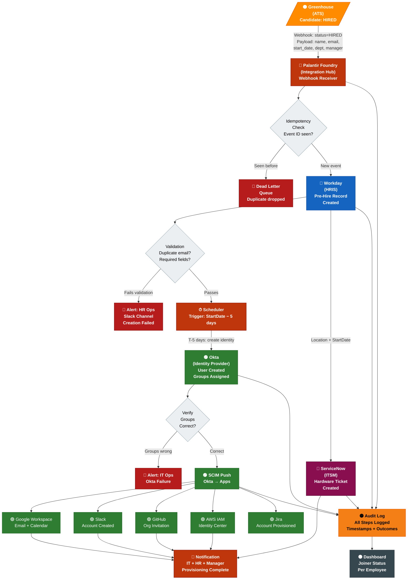
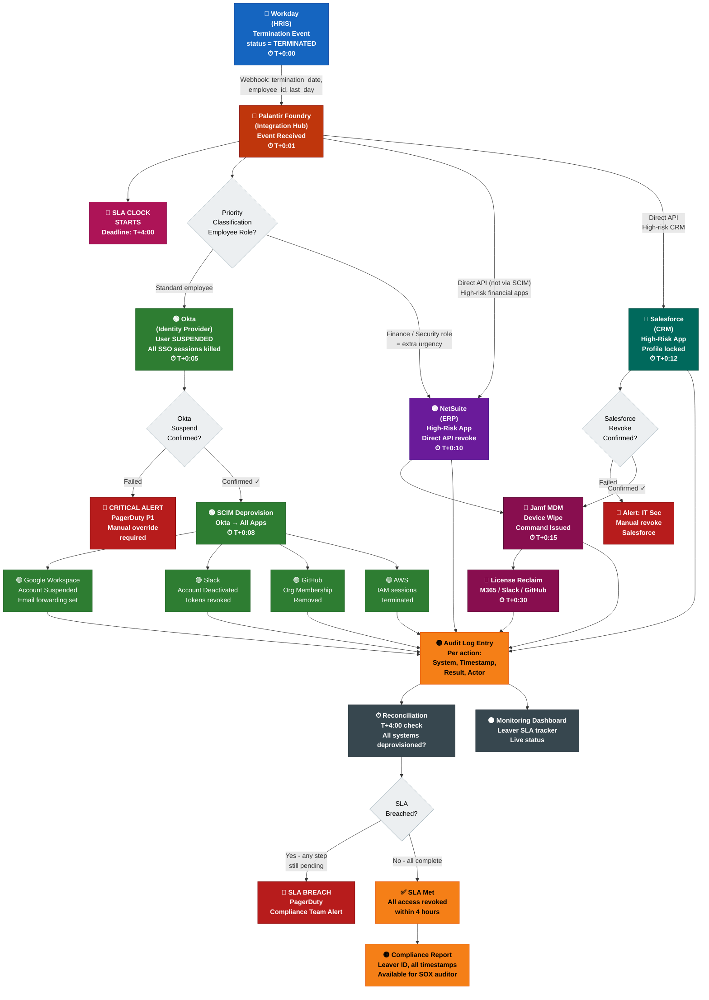
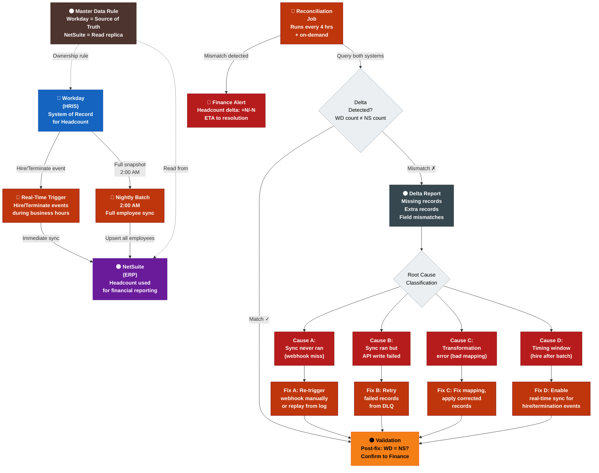
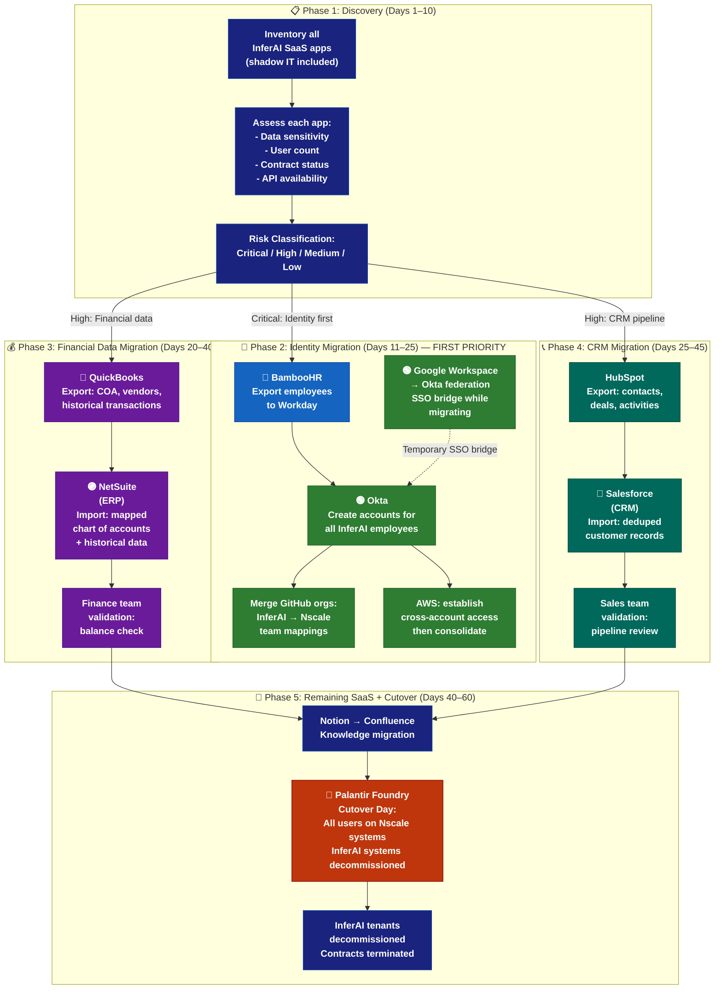
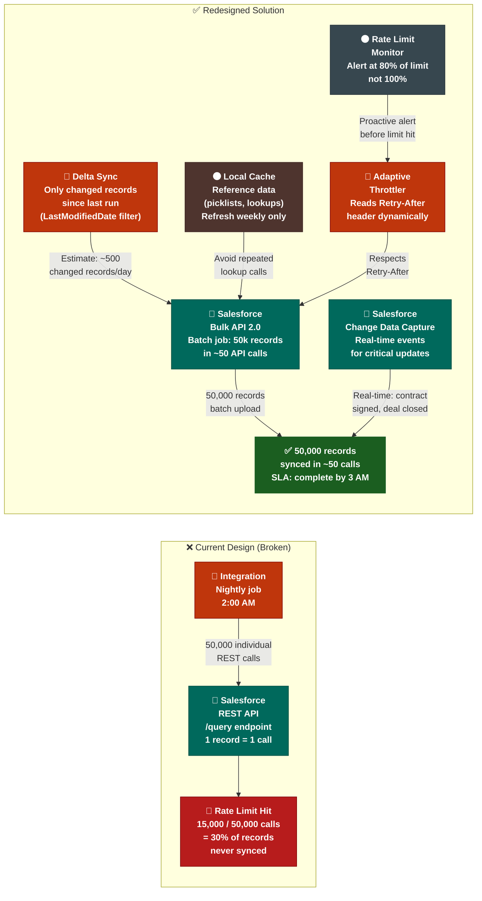
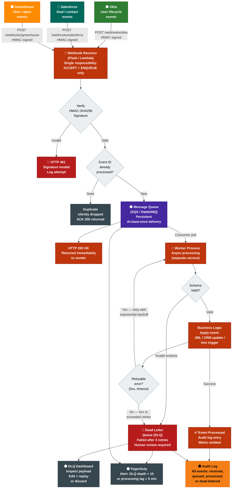
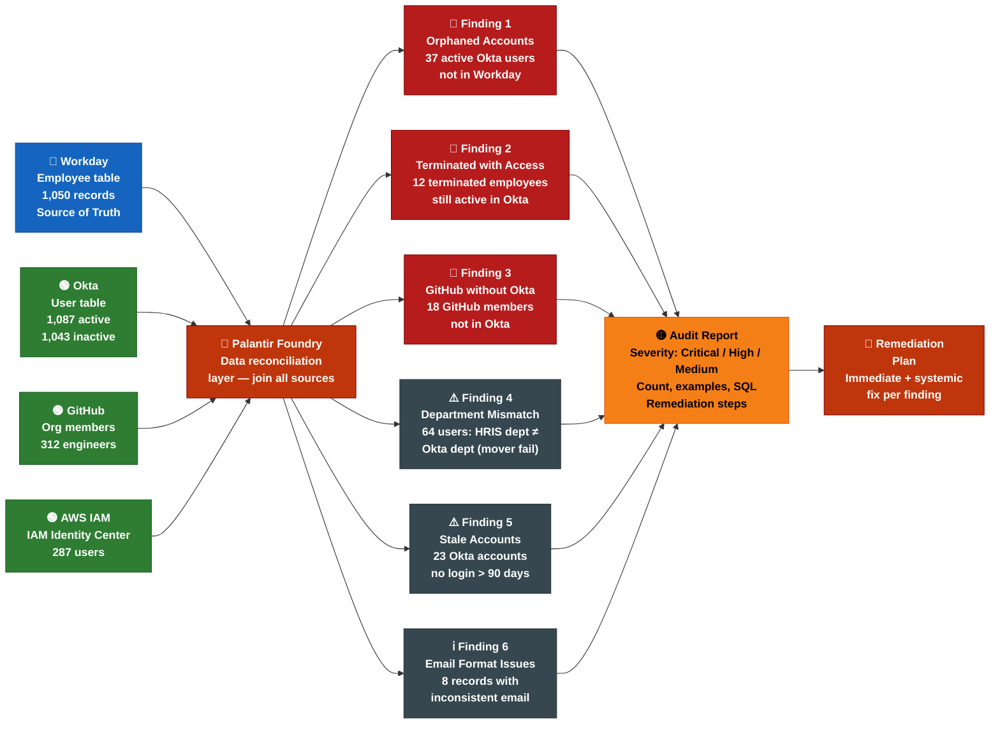

```mermaid
flowchart LR
    classDef hris fill:#1565C0,stroke:#0D47A1,color:#fff,font-weight:bold
    classDef idp fill:#2E7D32,stroke:#1B5E20,color:#fff,font-weight:bold
    classDef ipaas fill:#BF360C,stroke:#7F0000,color:#fff,font-weight:bold
    classDef erp fill:#6A1B9A,stroke:#4A148C,color:#fff,font-weight:bold
    classDef crm fill:#00695C,stroke:#004D40,color:#fff,font-weight:bold
    classDef audit fill:#F57F17,stroke:#E65100,color:#000,font-weight:bold
    classDef decision fill:#ECEFF1,stroke:#90A4AE,color:#000
    classDef error fill:#B71C1C,stroke:#7F0000,color:#fff,font-weight:bold
    classDef review fill:#4527A0,stroke:#311B92,color:#fff,font-weight:bold

    WD["🔵 Workday\n(HRIS)\njob_title changed\ndepartment unchanged\nmanager_id updated"]:::hris
    FDY["🔶 Palantir Foundry\nChange Event\nDetected"]:::ipaas
    DIFF{"Compute\nAccess Delta\nOld role vs New role"}:::decision

    ADD["+ Add Groups\nin Okta:\nsales-manager\nnetsuiite-write\nsfdc-admin"]:::idp
    REMOVE["− Remove Groups\nfrom Okta:\nsales-ic\nnetsuite-readonly\nsfdc-standard-user"]:::idp

    OKTA["🟢 Okta\nPATCH /api/v1/users/{id}\nUpdate: title, managerId\nGroup delta applied"]:::idp

    SFDC["🩵 Salesforce\nProfile upgraded:\nStandard User →\nSales Manager Profile\nNew permission sets added"]:::crm
    NET["🟣 NetSuite\nRole assignment\nupdated:\nRead-only → Full access\nfinancial reports unlocked"]:::erp

    REVIEW["🟤 Access Review\nTriggered\nNew manager notified\n'Confirm inherited access'"]:::review
    CONFLICT{"Sensitive\nPermission\nConflict?"}:::decision
    HOLD["🔴 Access Held\nPending\nManager Approval"]:::error

    AUDIT["🟡 Audit Log\nRole change event\nOld groups, new groups\ntimestamp"]:::audit

    WD -->|"job_change webhook\npayload: old_title, new_title,\nnew_manager_id"| FDY
    FDY --> DIFF
    DIFF -->|"Groups to add"| ADD
    DIFF -->|"Groups to remove"| REMOVE
    ADD --> OKTA
    REMOVE --> OKTA
    OKTA --> SFDC
    OKTA --> NET
    NET --> CONFLICT
    CONFLICT -->|"No conflict"| REVIEW
    CONFLICT -->|"SoD violation detected\n(e.g. approve + pay)"| HOLD
    REVIEW --> AUDIT
    HOLD --> AUDIT
```

# Hands-On Assessment Pack
## Systems Integration Engineer — Nscale
### 8 Real-World Scenario Assessments with Data Flow Diagrams

---

## Color Legend for All Diagrams

Every data flow diagram in this pack uses the same color system. Learn it once; read any diagram instantly.

| System Type | Color Code | Hex | Examples |
|------------|-----------|-----|---------|
| **ATS** (Applicant Tracking) | 🟠 Orange | `#FF8C00` | Greenhouse, Lever |
| **HRIS** (HR Information System) | 🔵 Blue | `#1565C0` | Workday, BambooHR |
| **IdP** (Identity Provider) | 🟢 Green | `#2E7D32` | Okta, Azure AD, JumpCloud |
| **ERP** (Enterprise Resource Planning) | 🟣 Purple | `#6A1B9A` | NetSuite, SAP |
| **CRM** (Customer Relationship Mgmt) | 🩵 Teal | `#00695C` | Salesforce, HubSpot |
| **iPaaS / Integration Hub** | 🔶 Deep Orange | `#BF360C` | Palantir Foundry, Workato, MuleSoft |
| **ITSM / Hardware** | 🩷 Pink | `#880E4F` | ServiceNow, Jira, device mgmt |
| **MDM / Data Store** | 🟤 Brown | `#4E342E` | Master data layer, data warehouse |
| **Monitoring / Alerting** | ⚫ Slate | `#37474F` | Datadog, PagerDuty, Grafana |
| **Compliance / Audit Log** | 🟡 Amber | `#F57F17` | SOX audit trail, ITGC evidence |
| **Error / Failure Path** | 🔴 Red | `#B71C1C` | Dead letter queue, failure alerts |
| **Decision Node** | ◇ White/Light | `#ECEFF1` | Conditional logic, branching |

---

## Assessment Index

| # | Scenario | Primary System | Difficulty | Time | Most Likely in Round |
|---|---------|---------------|------------|------|---------------------|
| 1 | Full JML Joiner — Offer to Day-1 Access | ATS → HRIS → IdP → Apps | ★★★★☆ | 90 min | Round 3 |
| 2 | JML Leaver — SOX-Compliant Deprovisioning | HRIS → IdP → All Apps | ★★★★★ | 90 min | Round 3 |
| 3 | JML Mover — Role Change Access Cascade | HRIS → IdP → App Re-provisioning | ★★★☆☆ | 60 min | Round 3 |
| 4 | HRIS ↔ ERP Headcount Reconciliation | Workday ↔ NetSuite | ★★★☆☆ | 60 min | Round 2 |
| 5 | M&A Integration — Acquired Company Onboarding | Multi-system migration | ★★★★★ | 90 min | Round 3 |
| 6 | API Rate Limiting & Bulk Sync Redesign | Salesforce API | ★★★☆☆ | 45 min | Round 2 |
| 7 | Webhook Reliability & Dead Letter Queue | Webhook receiver | ★★★★☆ | 60 min | Round 2 |
| 8 | Cross-System Data Quality Audit | Multi-system SQL + governance | ★★★★☆ | 60 min | Round 2/3 |

---

## Scenario 1: Full JML Joiner — Offer to Day-1 Access

### Context

A candidate accepts an offer in Greenhouse on Monday. They start the following Monday. Nscale has 1,000 employees and uses: Greenhouse (ATS), Workday (HRIS), Okta (IdP), Google Workspace, Slack, GitHub, AWS IAM Identity Center, Jira, and ServiceNow (ITSM). Hardware is ordered via a vendor API.

### What This Tests

| Dimension | Detail |
|-----------|--------|
| JML depth | Can you design the full 5-step flow without prompting? |
| System ordering | Do you know HRIS must precede IdP, which precedes app provisioning? |
| Timing logic | Do you know Okta should be created 5 days before start, not on day 1? |
| RBAC thinking | Is access driven by role/department rules, not manual assignment? |
| Compliance | Do you add audit logging, SOX controls, and no-early-access guardrails? |
| Error handling | What happens if Workday creation fails? Does Okta still get created? |
| Idempotency | What if the webhook fires twice for the same candidate? |

---

### Data Flow Diagram



---

### Task Prompt

> **Time: 90 minutes**
>
> Design and partially implement the Joiner automation workflow for Nscale.
>
> **Deliverable 1 — Design Document (30 min):**
> Write a complete integration specification covering:
> - All systems involved and the sequence of operations
> - Trigger mechanism and payload structure from Greenhouse
> - Full data mapping table: Greenhouse fields → Workday fields → Okta fields
> - Timing logic (when does each step trigger relative to start date?)
> - Error handling at each step: what fails independently vs. what cascades?
> - Idempotency strategy
>
> **Deliverable 2 — Python Implementation (40 min):**
> Implement the Workday pre-hire creation step (Step 1) as a production-quality webhook handler. Requirements:
> - Verify Greenhouse webhook signature (HMAC-SHA256)
> - Parse and validate required fields
> - Call Workday API using OAuth 2.0 Client Credentials
> - Handle: duplicate records (409), rate limits (429), transient failures (5xx)
> - Emit structured audit log entry on completion or failure
> - Write at least 2 unit tests for your implementation
>
> **Deliverable 3 — SOX Controls List (10 min):**
> List 6 specific SOX ITGC controls built into this workflow.
>
> **Deliverable 4 — Failure Scenarios (10 min):**
> Describe what happens if: (a) Greenhouse fires the webhook twice, (b) Workday API is down for 2 hours, (c) the employee's start date is moved forward 3 days after Okta account is already created.

---

### Sample Strong Response — Unit Tests

```python
import pytest
from unittest.mock import patch, MagicMock
from app import create_workday_prehire, verify_greenhouse_signature
import hmac, hashlib

# --- Unit Test 1: Valid employee creation ---
@patch("app.requests.post")
@patch("app.get_workday_access_token", return_value="fake_token")
def test_create_workday_prehire_success(mock_token, mock_post):
    mock_post.return_value = MagicMock(
        status_code=201,
        json=lambda: {"id": "WD-001", "workEmail": "alice@nscale.com"}
    )
    result = create_workday_prehire({
        "first_name": "Alice",
        "last_name": "Smith",
        "email": "alice@nscale.com",
        "start_date": "2026-06-02",
        "department": "Engineering"
    })
    assert result["id"] == "WD-001"
    mock_post.assert_called_once()

# --- Unit Test 2: Duplicate record raises ValueError ---
@patch("app.requests.post")
@patch("app.get_workday_access_token", return_value="fake_token")
def test_create_workday_prehire_duplicate(mock_token, mock_post):
    mock_post.return_value = MagicMock(status_code=409)
    with pytest.raises(ValueError, match="already exists"):
        create_workday_prehire({
            "first_name": "Bob",
            "last_name": "Jones",
            "email": "bob@nscale.com",
            "start_date": "2026-06-02",
            "department": "Finance"
        })

# --- Unit Test 3: Retry on 429 then succeed ---
@patch("app.time.sleep")
@patch("app.requests.post")
@patch("app.get_workday_access_token", return_value="fake_token")
def test_create_workday_prehire_retries_on_429(mock_token, mock_post, mock_sleep):
    mock_post.side_effect = [
        MagicMock(status_code=429),
        MagicMock(status_code=201, json=lambda: {"id": "WD-002"})
    ]
    result = create_workday_prehire({
        "first_name": "Carol",
        "last_name": "Lee",
        "email": "carol@nscale.com",
        "start_date": "2026-06-02",
        "department": "Sales"
    })
    assert result["id"] == "WD-002"
    assert mock_post.call_count == 2
    mock_sleep.assert_called_once_with(1)  # 2^0 = 1s backoff

# --- Unit Test 4: Webhook signature verification ---
def test_verify_greenhouse_signature_valid():
    secret = "test_secret"
    body = b'{"application": {"id": 123}}'
    sig = hmac.new(secret.encode(), body, hashlib.sha256).hexdigest()
    with patch("app.GREENHOUSE_WEBHOOK_SECRET", secret):
        assert verify_greenhouse_signature(body, sig) is True

def test_verify_greenhouse_signature_invalid():
    secret = "test_secret"
    body = b'{"application": {"id": 123}}'
    with patch("app.GREENHOUSE_WEBHOOK_SECRET", secret):
        assert verify_greenhouse_signature(body, "tampered_signature") is False
```

---

### Evaluation Rubric

| Dimension | 1 (Weak) | 2 (Acceptable) | 3 (Strong) | 4 (Excellent) | Max |
|-----------|---------|----------------|-----------|---------------|-----|
| System sequencing | Wrong order or missing HRIS step | Correct order, some gaps | All 5 steps in correct order | All steps + timing logic (T-5 days) | 8 |
| Data mapping | Assumed automatic | 3–4 fields mapped | Full mapping table all systems | Full mapping + transformation notes | 8 |
| Error handling | Not addressed | One system covered | All steps have independent error handling | Cascading logic + DLQ + alerts | 8 |
| Idempotency | Not mentioned | Mentioned, not implemented | Implemented with event ID store | Event ID + 409 handling + dedup | 8 |
| Code quality | Non-functional | Works but no tests | Works + error handling | Works + tests + structured logging | 8 |
| SOX controls | Generic or missing | 3 controls, vague | 6 specific controls | Controls wired into code, not just listed | 8 |
| Failure scenarios | 1 of 3 addressed | 2 of 3 addressed | All 3 addressed | All 3 + rollback/compensating action | 4 |

**Total: 52 points. Pass: 38/52 (73%)**

---

---

## Scenario 2: JML Leaver — SOX-Compliant Deprovisioning

### Context

An employee is terminated in Workday. It is 3 PM on a Friday. Nscale has a SOX ITGC control requiring all access to be revoked within **4 hours** of termination. The employee had access to: Okta (SSO), Google Workspace, Slack, GitHub, AWS, NetSuite (ERP with financial data), Salesforce, and a company-issued MacBook managed via Jamf MDM.

### What This Tests

| Dimension | Detail |
|-----------|--------|
| SLA awareness | 4-hour deprovisioning is a real SOX requirement — do you design for it? |
| Sequencing | Must Okta be deactivated before or after individual apps? (Before — it's the master switch) |
| High-risk app handling | Financial systems (NetSuite, Salesforce) require additional verification |
| Device management | MDM wipe is a separate workflow from identity deprovisioning |
| Audit trail | Every action must be timestamped and logged for auditor review |
| Failure recovery | What if Okta deactivation succeeds but NetSuite API call fails? |
| Reconciliation | How do you prove the SLA was met after the fact? |

---

### Data Flow Diagram



---

### Task Prompt

> **Time: 90 minutes**
>
> **Deliverable 1 — Leaver Workflow Design (25 min):**
> Design the complete leaver workflow. For each step specify:
> - System, API endpoint, auth method
> - Expected response and how you confirm success
> - What you do if the step fails (immediate action + systemic fix)
> - Maximum acceptable latency for that step
>
> **Deliverable 2 — SOX Evidence Package (15 min):**
> A SOX auditor asks you to prove the leaver SLA was met for the last 90 days. Describe:
> - What log data you capture at each step
> - The SQL query you'd run to generate the evidence report
> - How you handle exceptions (steps that failed but were manually remediated)
>
> **Deliverable 3 — Reconciliation Job (30 min):**
> Write a Python script that:
> - Queries Workday for all employees terminated in the last 7 days
> - Queries Okta for all currently active users
> - Cross-references the two lists
> - Outputs a report of any active Okta accounts for terminated employees
> - Triggers an immediate deactivation for any found
>
> **Deliverable 4 — Failure Mode Analysis (20 min):**
> For each of the following, describe root cause and systemic fix:
> - Scenario A: Okta deactivation succeeded but GitHub org membership was not removed
> - Scenario B: NetSuite API returned 503 at 3 PM on a Friday; not retried until Monday
> - Scenario C: Employee was terminated twice in Workday (data entry error, then corrected) — your workflow triggered twice

---

### Sample Strong Response — Reconciliation Script

```python
import os
import logging
from datetime import datetime, timedelta
from typing import List, Dict
import requests

logging.basicConfig(
    level=logging.INFO,
    format='%(asctime)s %(levelname)s %(message)s'
)
logger = logging.getLogger(__name__)


def get_workday_token() -> str:
    resp = requests.post(
        os.environ["WORKDAY_TOKEN_URL"],
        data={
            "grant_type": "client_credentials",
            "client_id": os.environ["WORKDAY_CLIENT_ID"],
            "client_secret": os.environ["WORKDAY_CLIENT_SECRET"],
        },
        timeout=10,
    )
    resp.raise_for_status()
    return resp.json()["access_token"]


def get_recently_terminated_employees(since_days: int = 7) -> List[Dict]:
    """Query Workday for employees terminated in the last N days."""
    token = get_workday_token()
    cutoff = (datetime.utcnow() - timedelta(days=since_days)).strftime("%Y-%m-%d")

    resp = requests.get(
        f"{os.environ['WORKDAY_API_BASE']}/workers",
        headers={"Authorization": f"Bearer {token}"},
        params={
            "status": "terminated",
            "terminationDateFrom": cutoff,
            "fields": "employeeId,email,fullName,terminationDate",
        },
        timeout=30,
    )
    resp.raise_for_status()
    workers = resp.json().get("workers", [])
    logger.info(f"Found {len(workers)} terminated employees since {cutoff}")
    return workers


def get_active_okta_users() -> Dict[str, Dict]:
    """Return dict of login (email) → user object for all active Okta users."""
    headers = {
        "Authorization": f"SSWS {os.environ['OKTA_API_TOKEN']}",
        "Accept": "application/json",
    }
    users = {}
    url = f"{os.environ['OKTA_BASE_URL']}/api/v1/users?filter=status+eq+%22ACTIVE%22&limit=200"

    while url:
        resp = requests.get(url, headers=headers, timeout=30)
        resp.raise_for_status()
        for user in resp.json():
            login = user["profile"]["login"].lower()
            users[login] = user
        # Okta uses Link header for pagination
        link_header = resp.headers.get("Link", "")
        url = None
        for part in link_header.split(","):
            if 'rel="next"' in part:
                url = part.split(";")[0].strip().strip("<>")
                break

    logger.info(f"Retrieved {len(users)} active Okta users")
    return users


def deactivate_okta_user(okta_id: str, email: str) -> bool:
    """Deactivate (suspend) an Okta user and log the action."""
    headers = {
        "Authorization": f"SSWS {os.environ['OKTA_API_TOKEN']}",
        "Content-Type": "application/json",
    }
    try:
        resp = requests.post(
            f"{os.environ['OKTA_BASE_URL']}/api/v1/users/{okta_id}/lifecycle/deactivate",
            headers=headers,
            timeout=15,
        )
        resp.raise_for_status()
        logger.warning(
            f"EMERGENCY_DEACTIVATION | email={email} | okta_id={okta_id} | "
            f"timestamp={datetime.utcnow().isoformat()} | result=SUCCESS"
        )
        return True
    except requests.HTTPError as e:
        logger.error(
            f"EMERGENCY_DEACTIVATION_FAILED | email={email} | okta_id={okta_id} | "
            f"error={str(e)}"
        )
        return False


def run_leaver_reconciliation(since_days: int = 7, auto_remediate: bool = True) -> Dict:
    """
    Main reconciliation job.
    Returns a report dict with violations and remediation outcomes.
    """
    report = {
        "run_at": datetime.utcnow().isoformat(),
        "lookback_days": since_days,
        "violations": [],
        "auto_remediated": [],
        "failed_remediations": [],
    }

    terminated = get_recently_terminated_employees(since_days)
    active_okta = get_active_okta_users()

    for employee in terminated:
        email = employee.get("email", "").lower()
        if not email:
            continue

        if email in active_okta:
            okta_user = active_okta[email]
            violation = {
                "employee_id": employee["employeeId"],
                "email": email,
                "full_name": employee.get("fullName"),
                "termination_date": employee.get("terminationDate"),
                "okta_id": okta_user["id"],
                "okta_status": okta_user["status"],
                "detected_at": datetime.utcnow().isoformat(),
            }
            report["violations"].append(violation)
            logger.error(
                f"LEAVER_VIOLATION | email={email} | "
                f"terminated={employee.get('terminationDate')} | "
                f"okta_still_active=True"
            )

            if auto_remediate:
                success = deactivate_okta_user(okta_user["id"], email)
                if success:
                    report["auto_remediated"].append(email)
                else:
                    report["failed_remediations"].append(email)

    logger.info(
        f"Reconciliation complete: {len(report['violations'])} violations, "
        f"{len(report['auto_remediated'])} auto-remediated, "
        f"{len(report['failed_remediations'])} failed"
    )
    return report


if __name__ == "__main__":
    result = run_leaver_reconciliation(since_days=7, auto_remediate=True)

    if result["violations"]:
        print(f"\n⚠️  {len(result['violations'])} LEAVER VIOLATIONS FOUND")
        for v in result["violations"]:
            print(f"  - {v['email']} terminated {v['termination_date']}, "
                  f"Okta still active (ID: {v['okta_id']})")
    else:
        print("\n✅ No leaver violations found.")

    if result["failed_remediations"]:
        print(f"\n🚨 MANUAL ACTION REQUIRED for: {result['failed_remediations']}")
```

---

### SOX Evidence SQL Query

```sql
-- Leaver SLA compliance report: all terminations in last 90 days
-- Shows time-to-deprovision per employee per system
SELECT
    t.employee_id,
    t.email,
    t.full_name,
    t.termination_timestamp,

    -- Time to Okta deactivation (most critical — master switch)
    oa.action_timestamp AS okta_deactivated_at,
    EXTRACT(EPOCH FROM (oa.action_timestamp - t.termination_timestamp)) / 3600.0
        AS hours_to_okta_deprovision,

    -- Time to NetSuite revocation (financial system — high priority)
    na.action_timestamp AS netsuite_revoked_at,
    EXTRACT(EPOCH FROM (na.action_timestamp - t.termination_timestamp)) / 3600.0
        AS hours_to_netsuite_deprovision,

    -- SLA compliance flag (4-hour requirement)
    CASE
        WHEN EXTRACT(EPOCH FROM (oa.action_timestamp - t.termination_timestamp)) / 3600.0 <= 4
             AND EXTRACT(EPOCH FROM (na.action_timestamp - t.termination_timestamp)) / 3600.0 <= 4
        THEN 'COMPLIANT'
        ELSE 'SLA BREACH'
    END AS sla_status,

    -- Exceptions log (manual remediations)
    ex.exception_note,
    ex.exception_approved_by

FROM termination_events t

LEFT JOIN integration_audit_log oa
    ON oa.employee_id = t.employee_id
    AND oa.system = 'okta'
    AND oa.action_type = 'deactivate'
    AND oa.result = 'success'

LEFT JOIN integration_audit_log na
    ON na.employee_id = t.employee_id
    AND na.system = 'netsuite'
    AND na.action_type = 'revoke_access'
    AND na.result = 'success'

LEFT JOIN leaver_exceptions ex
    ON ex.employee_id = t.employee_id

WHERE t.termination_timestamp >= NOW() - INTERVAL '90 days'
ORDER BY t.termination_timestamp DESC;
```

---

### Evaluation Rubric

| Dimension | Max Score |
|-----------|-----------|
| Leaver workflow completeness (all systems, correct sequence) | 12 |
| SOX evidence design (log schema, SQL query, exception handling) | 10 |
| Reconciliation script correctness and quality | 12 |
| Error handling and failure mode analysis | 10 |
| Compliance framing (SLA, audit trail, P1 alerts) | 8 |

**Total: 52 points. Pass: 38/52 (73%)**

---

---

## Scenario 3: JML Mover — Role Change Access Cascade

### Context

An employee moves from an Individual Contributor in the Sales team to a Sales Manager role. This triggers: new Okta group memberships, additional application access (Salesforce admin profile upgrade, NetSuite read-only → write access), removal of old group permissions, and an access review notification to the new manager.

### What This Tests

| Dimension | Detail |
|-----------|--------|
| Least-privilege principle | Do you remove old access before or alongside granting new access? |
| Access review trigger | Do you know role changes require an access review, not just provisioning? |
| Attribute-driven vs. request-driven | Is access driven by role attributes in HRIS, not manual ticket? |
| Partial update handling | PATCH vs. PUT for updating Okta user attributes |
| Conflict resolution | What if the new role's access conflicts with existing access? |

---

### Data Flow Diagram



---

### Task Prompt

> **Time: 60 minutes**
>
> **Deliverable 1 — Mover Workflow Design (20 min):**
> Design the complete mover workflow. Focus on:
> - How you compute the "access delta" (what to add, what to remove)
> - Whether you add first or remove first (and why — least privilege principle)
> - How you detect Segregation of Duties (SoD) conflicts in the new role
>
> **Deliverable 2 — PATCH vs. PUT Explanation + Code (20 min):**
> Explain when to use PATCH vs. PUT for Okta user updates. Write the API call to update an Okta user's group memberships atomically (add new groups and remove old groups in a single logical operation).
>
> **Deliverable 3 — Access Review Trigger (20 min):**
> Design the access review notification to the new manager. What information does it contain? How long does the manager have to respond? What happens if they don't respond?

---

### Sample Strong Response — Access Delta Computation

```python
from dataclasses import dataclass
from typing import Set


@dataclass
class AccessDelta:
    groups_to_add: Set[str]
    groups_to_remove: Set[str]
    attributes_to_update: dict


ROLE_TO_OKTA_GROUPS = {
    "sales_ic": {"sales-all", "sfdc-standard-user", "netsuite-readonly", "slack-sales"},
    "sales_manager": {"sales-all", "sales-managers", "sfdc-admin", "netsuite-write",
                      "slack-sales", "slack-managers", "jira-project-lead"},
    "finance_ic": {"finance-all", "netsuite-readonly", "sfdc-readonly", "slack-finance"},
    "finance_manager": {"finance-all", "finance-managers", "netsuite-full", "sfdc-readonly",
                        "slack-finance", "slack-managers"},
}

# Segregation of Duties rules: these group combos are prohibited
SOD_CONFLICTS = [
    {"netsuite-write", "netsuite-approve-payments"},   # Can't create and approve payments
    {"sfdc-admin", "sfdc-billing-admin"},               # Can't hold both admin roles
]


def compute_access_delta(old_role: str, new_role: str,
                          current_groups: Set[str]) -> AccessDelta:
    old_groups = ROLE_TO_OKTA_GROUPS.get(old_role, set())
    new_groups = ROLE_TO_OKTA_GROUPS.get(new_role, set())

    to_add = new_groups - current_groups
    to_remove = old_groups - new_groups

    return AccessDelta(
        groups_to_add=to_add,
        groups_to_remove=to_remove,
        attributes_to_update={"title": new_role.replace("_", " ").title()},
    )


def check_sod_conflicts(resulting_groups: Set[str]) -> list:
    conflicts = []
    for conflict_set in SOD_CONFLICTS:
        if conflict_set.issubset(resulting_groups):
            conflicts.append(conflict_set)
    return conflicts


def apply_mover_workflow(okta_id: str, old_role: str, new_role: str,
                          current_groups: Set[str], okta_client) -> dict:
    delta = compute_access_delta(old_role, new_role, current_groups)

    # Check SoD BEFORE making any changes
    resulting_groups = (current_groups | delta.groups_to_add) - delta.groups_to_remove
    conflicts = check_sod_conflicts(resulting_groups)

    if conflicts:
        # Hold access pending manager approval — do NOT auto-provision
        notify_access_review(okta_id, conflicts, new_role, hold=True)
        return {"status": "held_pending_review", "conflicts": [list(c) for c in conflicts]}

    # Remove old access FIRST (least privilege — never hold excess access)
    for group_id in delta.groups_to_remove:
        okta_client.remove_user_from_group(okta_id, group_id)

    # Then add new access
    for group_id in delta.groups_to_add:
        okta_client.add_user_to_group(okta_id, group_id)

    # Update user profile attributes
    okta_client.patch_user(okta_id, delta.attributes_to_update)

    # Trigger access review (non-blocking — manager confirms within 48 hrs)
    notify_access_review(okta_id, [], new_role, hold=False)

    return {"status": "applied", "added": list(delta.groups_to_add),
            "removed": list(delta.groups_to_remove)}


def notify_access_review(okta_id: str, conflicts: list, new_role: str,
                          hold: bool):
    # Post to access review system / email manager
    pass
```

---

### Evaluation Rubric

| Dimension | Max Score |
|-----------|-----------|
| Access delta logic (add vs. remove, least privilege ordering) | 10 |
| SoD conflict detection and hold workflow | 10 |
| PATCH vs. PUT explanation with correct API call | 8 |
| Access review design (content, SLA, escalation) | 8 |
| Code quality and test coverage | 4 |

**Total: 40 points. Pass: 28/40 (70%)**

---

---

## Scenario 4: HRIS ↔ ERP Headcount Reconciliation

### Context

Nscale's Finance team closes the books on the last business day of each month. The headcount in Workday (HRIS) must exactly match NetSuite (ERP) for financial reporting. A nightly batch sync runs at 2 AM, but same-day hires and terminations create discrepancies by month-end close at 6 PM.

### What This Tests

| Dimension | Detail |
|-----------|--------|
| Batch vs. real-time trade-offs | Can you explain why a nightly batch breaks at month-end? |
| Data reconciliation SQL | Can you write the diff queries and a reconciliation report? |
| Root cause isolation | Can you tell the difference between: sync never ran, sync ran but failed, sync ran and succeeded but ERP write was rejected? |
| Business communication | Can you tell Finance the current delta in 5 minutes while also fixing it? |
| MDM | Do you know Workday is the system of record and NetSuite should follow? |

---

### Data Flow Diagram



---

### Task Prompt

> **Time: 60 minutes**
>
> **Deliverable 1 — Reconciliation SQL (25 min):**
> Write SQL queries to:
> 1. Find employees in Workday but missing in NetSuite (sync failure)
> 2. Find employees in NetSuite but NOT in Workday (ghost records — possible compliance risk)
> 3. Find employees where department doesn't match between the two systems
> 4. Generate a summary reconciliation report: total counts, delta count, and % discrepancy
>
> **Deliverable 2 — Root Cause Runbook (20 min):**
> Write a short runbook for on-call engineers that covers: how to diagnose which of the 4 root causes applies, and the exact steps to fix each one.
>
> **Deliverable 3 — Architecture Fix (15 min):**
> The current nightly batch is insufficient. Propose an architecture change that eliminates the timing window problem for hires and terminations, while keeping the nightly batch as a full-reconciliation safety net. What are the trade-offs?

---

### Sample Strong Response — Reconciliation SQL

```sql
-- Assumes tables: workday_employees, netsuite_employees
-- Shared key: employee_id (canonical from Workday)

-- Q1: In Workday but missing from NetSuite (sync failure — undercounting in ERP)
SELECT
    w.employee_id,
    w.email,
    w.full_name,
    w.status      AS workday_status,
    w.hire_date,
    w.department
FROM workday_employees w
LEFT JOIN netsuite_employees n ON w.employee_id = n.workday_employee_id
WHERE w.status = 'active'
  AND n.workday_employee_id IS NULL
ORDER BY w.hire_date DESC;

-- Q2: In NetSuite but NOT in Workday (ghost/orphaned record — overcounting)
SELECT
    n.netsuite_id,
    n.email,
    n.full_name,
    n.workday_employee_id,
    n.created_date AS netsuite_created
FROM netsuite_employees n
LEFT JOIN workday_employees w ON n.workday_employee_id = w.employee_id
WHERE n.is_active = TRUE
  AND w.employee_id IS NULL
ORDER BY n.created_date DESC;

-- Q3: Department mismatch between systems (stale data)
SELECT
    w.employee_id,
    w.email,
    w.department   AS workday_dept,
    n.department   AS netsuite_dept,
    w.last_modified AS workday_updated,
    n.last_modified AS netsuite_updated
FROM workday_employees w
INNER JOIN netsuite_employees n ON w.employee_id = n.workday_employee_id
WHERE w.status = 'active'
  AND LOWER(TRIM(w.department)) != LOWER(TRIM(n.department))
ORDER BY w.last_modified DESC;

-- Q4: Executive reconciliation summary
WITH workday_active AS (
    SELECT COUNT(*) AS cnt FROM workday_employees WHERE status = 'active'
),
netsuite_active AS (
    SELECT COUNT(*) AS cnt FROM netsuite_employees WHERE is_active = TRUE
),
missing_in_ns AS (
    SELECT COUNT(*) AS cnt
    FROM workday_employees w
    LEFT JOIN netsuite_employees n ON w.employee_id = n.workday_employee_id
    WHERE w.status = 'active' AND n.workday_employee_id IS NULL
),
ghost_in_ns AS (
    SELECT COUNT(*) AS cnt
    FROM netsuite_employees n
    LEFT JOIN workday_employees w ON n.workday_employee_id = w.employee_id
    WHERE n.is_active = TRUE AND w.employee_id IS NULL
),
dept_mismatches AS (
    SELECT COUNT(*) AS cnt
    FROM workday_employees w
    INNER JOIN netsuite_employees n ON w.employee_id = n.workday_employee_id
    WHERE w.status = 'active'
      AND LOWER(TRIM(w.department)) != LOWER(TRIM(n.department))
)
SELECT
    wa.cnt                                          AS workday_active_count,
    na.cnt                                          AS netsuite_active_count,
    wa.cnt - na.cnt                                 AS raw_delta,
    mn.cnt                                          AS missing_in_netsuite,
    gn.cnt                                          AS ghost_records_in_netsuite,
    dm.cnt                                          AS department_mismatches,
    ROUND((mn.cnt::numeric / NULLIF(wa.cnt, 0)) * 100, 2) AS missing_pct,
    NOW()                                           AS report_generated_at
FROM workday_active wa, netsuite_active na, missing_in_ns mn,
     ghost_in_ns gn, dept_mismatches dm;
```

---

### Evaluation Rubric

| Dimension | Max Score |
|-----------|-----------|
| SQL correctness and completeness (all 4 queries) | 16 |
| Root cause runbook (all 4 causes identified with steps) | 12 |
| Architecture fix (real-time events + batch safety net) | 8 |
| Business communication framing | 4 |

**Total: 40 points. Pass: 28/40 (70%)**

---

---

## Scenario 5: M&A Integration — Acquired Company Onboarding

### Context

Nscale acquires a 200-person AI startup called "InferAI." InferAI uses: Bamboo HR (HRIS), Google Workspace (email/IdP), GitHub (separate org), AWS (separate account), HubSpot (CRM), QuickBooks (ERP), Notion (wiki), and 8 other SaaS tools. Day 1 post-acquisition closes in 60 days. All InferAI employees must be on Nscale systems by Day 1. Financial data must be migrated to NetSuite. The CRM pipeline must be visible in Salesforce.

### What This Tests

| Dimension | Detail |
|-----------|--------|
| M&A framework | Do you have a structured approach (discover → assess → prioritize → migrate)? |
| Risk assessment | Can you identify the highest-risk integration points (financial data, access control)? |
| Sequencing | JML migration must happen before application migration — do you know this? |
| Data migration vs. integration | Do you distinguish one-time data migration from ongoing integration? |
| Stakeholder management | IT, Finance, HR, Legal, and Engineering all have conflicting priorities |

---

### Data Flow Diagram



---

### Task Prompt

> **Time: 90 minutes**
>
> **Deliverable 1 — Integration Assessment Framework (20 min):**
> For each InferAI system, fill in the assessment table:
>
> | System | Data Sensitivity | User Count | Migration Type | Priority | Risk |
> |--------|-----------------|------------|---------------|----------|------|
> | BambooHR | | | | | |
> | Google Workspace | | | | | |
> | GitHub (separate org) | | | | | |
> | AWS (separate account) | | | | | |
> | HubSpot | | | | | |
> | QuickBooks | | | | | |
>
> **Deliverable 2 — 60-Day Integration Plan (25 min):**
> Create a sequenced 4-phase plan with: what gets migrated in each phase, why that order, key dependencies, and go/no-go criteria for each phase.
>
> **Deliverable 3 — Identity Migration Technical Design (30 min):**
> Design the employee identity migration from BambooHR + Google Workspace to Workday + Okta. Cover:
> - How you export 200 employees from BambooHR
> - How you map them to Workday records without duplicating existing records
> - How you create Okta accounts with the right groups based on InferAI's role structure
> - How you handle the email domain change (inferai.com → nscale.com)
> - What temporary access you provide during the transition period
>
> **Deliverable 4 — Stakeholder Risk Communication (15 min):**
> Write a 150-word summary for the CEO explaining the top 3 risks in this 60-day integration and what you're doing to mitigate each.

---

### Evaluation Rubric

| Dimension | Max Score |
|-----------|-----------|
| Assessment framework completeness and accuracy | 10 |
| 60-day plan: sequencing logic and dependency understanding | 15 |
| Identity migration technical depth | 15 |
| Risk identification and prioritization | 8 |
| Stakeholder communication clarity | 4 |
| Realistic timeline (not too optimistic) | 4 |

**Total: 56 points. Pass: 40/56 (71%)**

---

---

## Scenario 6: API Rate Limiting & Bulk Sync Redesign

### Context

Nscale's Salesforce integration syncs 50,000 customer records nightly. The REST API is hitting the 15,000 daily call limit by 3 AM, causing partial syncs. The integration was originally built for 2,000 records. Headcount and customer base have grown 25x.

### What This Tests

| Dimension | Detail |
|-----------|--------|
| API knowledge depth | Do you know Salesforce has a Bulk API 2.0 designed exactly for this? |
| Performance thinking | Do you think about batching, parallelism, and rate limit headers? |
| Incremental sync design | Can you change from full refresh to delta sync? |
| Operational impact | Do you understand what a partial sync means for downstream reports? |
| Monitoring | Can you detect this class of problem before it becomes a business issue? |

---

### Data Flow Diagram



---

### Task Prompt

> **Time: 45 minutes**
>
> **Deliverable 1 — Root Cause Analysis (10 min):**
> Explain why the current integration is hitting the rate limit and the business impact of a 70% partial sync (which data is missing and who notices first?).
>
> **Deliverable 2 — Redesigned Integration (25 min):**
> Design the new Salesforce sync architecture. Cover:
> - Why Bulk API 2.0 instead of REST API for large datasets
> - How you implement a delta sync (only changed records since last run) — what field in Salesforce do you filter on?
> - How you use Salesforce Change Data Capture (CDC) webhooks for real-time critical updates
> - How you cache reference data to eliminate redundant API calls
>
> **Deliverable 3 — Monitoring (10 min):**
> Design the monitoring for the new integration. What metric alerts you before the rate limit is hit (not after)?

---

### Sample Strong Response — Delta Sync Implementation

```python
from datetime import datetime, timedelta, timezone
import requests
import json
import time


class SalesforceBulkSync:
    """
    Incremental Salesforce sync using Bulk API 2.0.
    Only syncs records modified since the last successful run.
    """

    def __init__(self, instance_url: str, access_token: str):
        self.instance_url = instance_url
        self.headers = {
            "Authorization": f"Bearer {access_token}",
            "Content-Type": "application/json",
        }
        self.api_calls_made = 0
        self.daily_limit = 15000
        self.alert_threshold = 0.80  # Alert at 80% of limit

    def get_last_sync_timestamp(self) -> str:
        """Retrieve last successful sync timestamp from persistent store."""
        # In production: read from database or integration state store
        # Default to 24 hours ago for first run
        cutoff = datetime.now(timezone.utc) - timedelta(hours=24)
        return cutoff.strftime("%Y-%m-%dT%H:%M:%S.000Z")

    def save_sync_timestamp(self, timestamp: str):
        """Persist the sync completion timestamp."""
        pass  # Write to database

    def check_rate_limit_headroom(self, response_headers: dict):
        """Alert proactively when approaching the rate limit."""
        remaining = int(response_headers.get("Sforce-Limit-Info", "api-usage=0/15000")
                        .split("=")[1].split("/")[0])
        self.api_calls_made = self.daily_limit - remaining
        usage_pct = self.api_calls_made / self.daily_limit

        if usage_pct >= self.alert_threshold:
            # In production: send PagerDuty P2 alert
            print(f"⚠️  Rate limit alert: {usage_pct:.0%} of daily quota used "
                  f"({self.api_calls_made}/{self.daily_limit} calls)")

    def create_bulk_query_job(self, soql: str) -> str:
        """Create a Bulk API 2.0 query job."""
        resp = requests.post(
            f"{self.instance_url}/services/data/v59.0/jobs/query",
            headers=self.headers,
            json={"operation": "query", "query": soql},
            timeout=30,
        )
        resp.raise_for_status()
        self.check_rate_limit_headroom(resp.headers)
        return resp.json()["id"]

    def wait_for_job_completion(self, job_id: str, poll_interval: int = 10) -> bool:
        """Poll until job is complete. Returns True if successful."""
        url = f"{self.instance_url}/services/data/v59.0/jobs/query/{job_id}"
        while True:
            resp = requests.get(url, headers=self.headers, timeout=15)
            resp.raise_for_status()
            state = resp.json()["state"]
            if state == "JobComplete":
                return True
            elif state in ("Failed", "Aborted"):
                raise Exception(f"Bulk job {job_id} failed with state: {state}")
            time.sleep(poll_interval)

    def get_job_results(self, job_id: str) -> list:
        """Retrieve all results for a completed bulk job (handles pagination)."""
        records = []
        locator = None

        while True:
            params = {}
            if locator:
                params["locator"] = locator

            resp = requests.get(
                f"{self.instance_url}/services/data/v59.0/jobs/query/{job_id}/results",
                headers={**self.headers, "Accept": "text/csv"},
                params=params,
                timeout=60,
            )
            resp.raise_for_status()
            self.check_rate_limit_headroom(resp.headers)

            # Parse CSV response (simplified — use csv.DictReader in production)
            lines = resp.text.strip().split("\n")
            headers = lines[0].split(",")
            for line in lines[1:]:
                values = line.split(",")
                records.append(dict(zip(headers, values)))

            locator = resp.headers.get("Sforce-Locator")
            if not locator or locator == "null":
                break

        return records

    def run_incremental_sync(self) -> dict:
        """Run a delta sync: only records modified since last run."""
        last_sync = self.get_last_sync_timestamp()
        sync_start = datetime.now(timezone.utc).strftime("%Y-%m-%dT%H:%M:%S.000Z")

        # Delta sync: filter by LastModifiedDate (1 API call for 50k records)
        soql = f"""
            SELECT Id, Name, Email, AccountId, StageName, Amount,
                   LastModifiedDate, OwnerId
            FROM Opportunity
            WHERE LastModifiedDate > {last_sync}
            ORDER BY LastModifiedDate ASC
        """

        print(f"Starting incremental sync from {last_sync}")
        job_id = self.create_bulk_query_job(soql)
        self.wait_for_job_completion(job_id)
        records = self.get_job_results(job_id)

        print(f"Synced {len(records)} changed records using "
              f"{self.api_calls_made} API calls total")

        self.save_sync_timestamp(sync_start)

        return {
            "records_synced": len(records),
            "api_calls_used": self.api_calls_made,
            "sync_start": last_sync,
            "sync_end": sync_start,
        }
```

---

### Evaluation Rubric

| Dimension | Max Score |
|-----------|-----------|
| Root cause analysis and business impact | 8 |
| Bulk API vs. REST API explanation | 8 |
| Delta sync design (LastModifiedDate filter, state management) | 10 |
| CDC/webhook for real-time events | 6 |
| Rate limit monitoring (proactive, not reactive) | 4 |
| Code quality | 4 |

**Total: 40 points. Pass: 28/40 (70%)**

---

---

## Scenario 7: Webhook Reliability & Dead Letter Queue

### Context

Nscale receives 500+ webhooks per hour from Okta (user events), Salesforce (deal events), and Greenhouse (hiring events). The current webhook receiver is a single Flask endpoint that processes synchronously. During a 15-minute outage of the processing service, 120 webhooks were silently dropped. The business didn't know until Finance noticed missing deal closures 3 days later.

### What This Tests

| Dimension | Detail |
|-----------|--------|
| Queue-based architecture | Can you explain why synchronous webhook processing is fragile? |
| At-least-once delivery | Do you know webhooks can be delivered multiple times? |
| Dead letter queue design | Can you design a DLQ with manual inspection and replay? |
| Signature verification | Do you verify webhook authenticity as a first step? |
| Schema evolution | What happens when Okta changes their webhook payload format? |

---

### Data Flow Diagram



---

### Task Prompt

> **Time: 60 minutes**
>
> **Deliverable 1 — Architecture Diagram Description (15 min):**
> Describe the queue-based webhook architecture in prose. Explain: why you return HTTP 200 before processing, why the queue provides durability, and how idempotency prevents duplicates.
>
> **Deliverable 2 — Production Webhook Receiver (30 min):**
> Rewrite the webhook receiver using an async queue pattern. Requirements:
> - Verify HMAC-SHA256 signature on arrival
> - Check idempotency (event ID store with TTL)
> - Enqueue to SQS (mock with a local list if needed)
> - Return HTTP 200 within 100ms regardless of downstream state
> - Emit a structured log entry for each received event
>
> **Deliverable 3 — DLQ Design (15 min):**
> Design the Dead Letter Queue system. Specify:
> - What information is stored per failed event
> - How an on-call engineer inspects the DLQ
> - The process for replaying a failed event
> - How you prevent a bad event from looping back into the DLQ repeatedly

---

### Sample Strong Response — Async Webhook Receiver

```python
import hashlib
import hmac
import json
import logging
import os
import time
from datetime import datetime, timezone
from typing import Optional
import redis
import boto3
from flask import Flask, request, jsonify

app = Flask(__name__)
logger = logging.getLogger(__name__)

# Redis for idempotency (TTL = 7 days to handle delayed duplicates)
redis_client = redis.Redis(
    host=os.environ["REDIS_HOST"], port=6379, decode_responses=True
)
IDEMPOTENCY_TTL_SECONDS = 7 * 24 * 3600

# SQS for durable queue
sqs = boto3.client("sqs", region_name=os.environ.get("AWS_REGION", "us-east-1"))
SQS_QUEUE_URL = os.environ["SQS_QUEUE_URL"]

WEBHOOK_SECRETS = {
    "okta": os.environ["OKTA_WEBHOOK_SECRET"],
    "salesforce": os.environ["SFDC_WEBHOOK_SECRET"],
    "greenhouse": os.environ["GH_WEBHOOK_SECRET"],
}


def verify_signature(source: str, payload_body: bytes, signature: str) -> bool:
    secret = WEBHOOK_SECRETS.get(source, "")
    expected = hmac.new(
        secret.encode(), payload_body, hashlib.sha256
    ).hexdigest()
    return hmac.compare_digest(f"sha256={expected}", signature)


def is_duplicate(event_id: str) -> bool:
    """Check Redis; return True if event was already processed."""
    key = f"webhook:processed:{event_id}"
    # SET NX (only set if not exists) — atomic check-and-set
    result = redis_client.set(key, "1", ex=IDEMPOTENCY_TTL_SECONDS, nx=True)
    return result is None  # None means key already existed → duplicate


def enqueue_event(source: str, event_id: str, payload: dict) -> str:
    """Enqueue event to SQS. Returns message ID."""
    message = {
        "source": source,
        "event_id": event_id,
        "received_at": datetime.now(timezone.utc).isoformat(),
        "payload": payload,
    }
    resp = sqs.send_message(
        QueueUrl=SQS_QUEUE_URL,
        MessageBody=json.dumps(message),
        MessageGroupId=source,  # FIFO queue grouping by source
        MessageDeduplicationId=event_id,
    )
    return resp["MessageId"]


def extract_event_id(source: str, payload: dict) -> Optional[str]:
    """Extract a stable event ID from each source's payload format."""
    extractors = {
        "okta": lambda p: p.get("data", {}).get("events", [{}])[0].get("uuid"),
        "salesforce": lambda p: p.get("payload", [{}])[0].get("ChangeEventHeader", {}).get("recordIds", [""])[0],
        "greenhouse": lambda p: str(p.get("application", {}).get("id")),
    }
    extractor = extractors.get(source)
    return extractor(payload) if extractor else None


@app.route("/webhooks/<source>", methods=["POST"])
def receive_webhook(source: str):
    """
    Single endpoint for all webhook sources.
    Responsibility: verify → dedup → enqueue → ack.
    NO business logic here.
    """
    receive_time = time.monotonic()

    if source not in WEBHOOK_SECRETS:
        return jsonify({"error": "Unknown source"}), 404

    # Step 1: Verify signature (reject spoofed events)
    signature = (
        request.headers.get("X-Okta-Verification-Challenge")
        or request.headers.get("X-Sfdc-Signature")
        or request.headers.get("X-Greenhouse-Signature", "")
    )
    if not verify_signature(source, request.data, signature):
        logger.warning(
            f"webhook.rejected | source={source} | reason=invalid_signature | "
            f"ip={request.remote_addr}"
        )
        return jsonify({"error": "Invalid signature"}), 401

    payload = request.get_json(force=True)

    # Step 2: Extract event ID for idempotency
    event_id = extract_event_id(source, payload)
    if not event_id:
        event_id = f"{source}:{int(time.time() * 1000)}"  # Fallback

    # Step 3: Idempotency check
    if is_duplicate(event_id):
        logger.info(f"webhook.duplicate | source={source} | event_id={event_id}")
        return jsonify({"status": "duplicate"}), 200  # Still return 200

    # Step 4: Enqueue (durable, async processing)
    try:
        message_id = enqueue_event(source, event_id, payload)
    except Exception as e:
        logger.error(f"webhook.enqueue_failed | source={source} | error={str(e)}")
        # Do NOT return 500 — that causes sender to retry immediately
        # Instead: log to fallback store and alert
        return jsonify({"status": "queued_to_fallback"}), 200

    elapsed_ms = (time.monotonic() - receive_time) * 1000
    logger.info(
        f"webhook.received | source={source} | event_id={event_id} | "
        f"message_id={message_id} | latency_ms={elapsed_ms:.1f}"
    )

    # Step 5: Acknowledge immediately (< 100ms total)
    return jsonify({"status": "accepted", "event_id": event_id}), 200


if __name__ == "__main__":
    app.run(port=8080, threaded=True)
```

---

### Evaluation Rubric

| Dimension | Max Score |
|-----------|-----------|
| Architecture explanation (queue, durability, idempotency) | 10 |
| Signature verification correctness | 8 |
| Idempotency implementation (atomic Redis SET NX) | 8 |
| Async enqueue pattern (returns 200 before processing) | 8 |
| DLQ design (storage, replay, loop prevention) | 8 |
| Code quality and structured logging | 4 |

**Total: 46 points. Pass: 33/46 (72%)**

---

---

## Scenario 8: Cross-System Data Quality Audit

### Context

Nscale's internal audit team flags that there are suspected orphaned accounts, stale access, and data inconsistencies across the employee identity estate. You have been given read access to exports from Workday, Okta, GitHub, and AWS IAM. You have 60 minutes to produce a full data quality report with findings, severity, and recommended fixes.

### What This Tests

| Dimension | Detail |
|-----------|--------|
| SQL fluency | Complex JOINs, aggregations, conditional logic, window functions |
| Security instincts | Orphaned accounts are a compliance and security risk — do you flag them first? |
| Data quality taxonomy | Can you categorize findings: orphaned, stale, mismatched, duplicate? |
| Governance thinking | Do you recommend systemic fixes, not just one-time data patches? |
| Communication | Can you present findings in a format an auditor can use? |

---

### Data Flow Diagram



---

### Task Prompt

> **Time: 60 minutes**
>
> **Deliverable — Complete Data Quality Audit Report:**
>
> Using the table schemas below, write SQL queries to find each of the 6 finding categories. Then produce a structured audit report with: finding name, severity, count, SQL query, sample record (hypothetical), and remediation recommendation.
>
> **Table schemas:**
> ```sql
> -- workday_employees
> -- employee_id, email, full_name, department, job_title, status,
> -- hire_date, termination_date, manager_email, location
>
> -- okta_users
> -- okta_id, login (email), full_name, department, status,
> -- created_at, last_login, profile_managed_by
>
> -- github_members
> -- github_id, github_username, email, org_role, team_memberships,
> -- added_date, last_active
>
> -- aws_iam_users
> -- iam_user_id, email, account_id, access_key_last_used,
> -- console_last_login, groups, created_date
> ```

---

### Sample Strong Response — All 6 SQL Queries

```sql
-- ==============================================================
-- DATA QUALITY AUDIT REPORT
-- Systems: Workday, Okta, GitHub, AWS IAM
-- Run date: CURRENT_DATE
-- ==============================================================


-- FINDING 1 (CRITICAL): Orphaned Okta accounts — active users not in Workday
-- Risk: Unauthorized access; SOX ITGC violation
SELECT
    o.okta_id,
    o.login                                        AS okta_email,
    o.full_name,
    o.created_at                                   AS okta_account_created,
    o.last_login,
    CURRENT_DATE - o.created_at::date              AS days_since_creation,
    'ORPHANED_ACCOUNT'                             AS finding_type,
    'CRITICAL'                                     AS severity
FROM okta_users o
LEFT JOIN workday_employees w ON LOWER(o.login) = LOWER(w.email)
WHERE o.status = 'ACTIVE'
  AND w.employee_id IS NULL
ORDER BY o.created_at ASC;   -- Oldest first = most concerning


-- FINDING 2 (CRITICAL): Terminated employees with active Okta access
-- Risk: Immediate security risk; SOX breach; potential data exfiltration
SELECT
    w.employee_id,
    w.email,
    w.full_name,
    w.termination_date,
    o.okta_id,
    o.status                                       AS okta_status,
    o.last_login,
    CURRENT_DATE - w.termination_date              AS days_since_termination,
    CASE
        WHEN CURRENT_DATE - w.termination_date > 1 THEN 'SLA_BREACH'
        ELSE 'PENDING_DEPROVISION'
    END                                            AS sla_status,
    'TERMINATED_WITH_ACCESS'                       AS finding_type,
    'CRITICAL'                                     AS severity
FROM workday_employees w
INNER JOIN okta_users o ON LOWER(w.email) = LOWER(o.login)
WHERE w.status = 'terminated'
  AND o.status = 'ACTIVE'
ORDER BY days_since_termination DESC;


-- FINDING 3 (HIGH): GitHub org members not in Okta
-- Risk: Access provisioned outside standard JML process; no audit trail
SELECT
    g.github_id,
    g.github_username,
    g.email,
    g.org_role,
    g.added_date,
    g.last_active,
    CURRENT_DATE - g.added_date                    AS days_in_org,
    'GITHUB_OUTSIDE_OKTA'                          AS finding_type,
    'HIGH'                                         AS severity
FROM github_members g
LEFT JOIN okta_users o ON LOWER(g.email) = LOWER(o.login)
WHERE o.okta_id IS NULL
  AND g.email IS NOT NULL
ORDER BY g.added_date ASC;


-- FINDING 4 (MEDIUM): Department mismatch — HRIS vs Okta
-- Risk: Mover workflow failed; user may have wrong app access
SELECT
    w.employee_id,
    w.email,
    w.full_name,
    w.department                                   AS workday_department,
    o.department                                   AS okta_department,
    w.job_title,
    'DEPARTMENT_MISMATCH'                          AS finding_type,
    'MEDIUM'                                       AS severity
FROM workday_employees w
INNER JOIN okta_users o ON LOWER(w.email) = LOWER(o.login)
WHERE w.status = 'active'
  AND o.status = 'ACTIVE'
  AND LOWER(TRIM(w.department)) != LOWER(TRIM(o.department))
ORDER BY w.department;


-- FINDING 5 (MEDIUM): Stale accounts — active Okta, no login in 90+ days
-- Risk: Unused accounts increase attack surface; possible license waste
SELECT
    o.okta_id,
    o.login                                        AS email,
    o.full_name,
    o.last_login,
    CURRENT_DATE - o.last_login::date              AS days_since_last_login,
    o.created_at,
    w.department,
    w.job_title,
    'STALE_ACCOUNT'                                AS finding_type,
    'MEDIUM'                                       AS severity
FROM okta_users o
INNER JOIN workday_employees w ON LOWER(o.login) = LOWER(w.email)
WHERE o.status = 'ACTIVE'
  AND w.status = 'active'
  AND (o.last_login IS NULL OR o.last_login < CURRENT_DATE - INTERVAL '90 days')
ORDER BY days_since_last_login DESC;


-- FINDING 6 (LOW): Email format inconsistencies
-- Risk: Join failures between systems; broken integrations; future sync errors
WITH email_issues AS (
    SELECT
        employee_id,
        email,
        full_name,
        'workday'                                  AS source,
        CASE
            WHEN email NOT LIKE '%@nscale.com'      THEN 'wrong_domain'
            WHEN email != LOWER(email)              THEN 'not_lowercase'
            WHEN email LIKE '% %'                   THEN 'contains_space'
            WHEN email NOT LIKE '%_@_%.__%'         THEN 'invalid_format'
        END                                        AS issue_type
    FROM workday_employees
    WHERE status = 'active'
      AND (
        email NOT LIKE '%@nscale.com'
        OR email != LOWER(email)
        OR email LIKE '% %'
        OR email NOT LIKE '%_@_%.__%'
      )
)
SELECT
    employee_id,
    email,
    full_name,
    source,
    issue_type,
    'EMAIL_FORMAT_ISSUE'                           AS finding_type,
    'LOW'                                          AS severity
FROM email_issues
ORDER BY issue_type, email;


-- ==============================================================
-- EXECUTIVE SUMMARY QUERY
-- ==============================================================
WITH findings AS (
    -- Orphaned accounts
    SELECT 'Orphaned Okta Accounts' AS finding, 'CRITICAL' AS severity,
           COUNT(*) AS record_count
    FROM okta_users o
    LEFT JOIN workday_employees w ON LOWER(o.login) = LOWER(w.email)
    WHERE o.status = 'ACTIVE' AND w.employee_id IS NULL

    UNION ALL

    -- Terminated with access
    SELECT 'Terminated with Active Access', 'CRITICAL', COUNT(*)
    FROM workday_employees w
    INNER JOIN okta_users o ON LOWER(w.email) = LOWER(o.login)
    WHERE w.status = 'terminated' AND o.status = 'ACTIVE'

    UNION ALL

    -- GitHub outside Okta
    SELECT 'GitHub Members outside Okta', 'HIGH', COUNT(*)
    FROM github_members g
    LEFT JOIN okta_users o ON LOWER(g.email) = LOWER(o.login)
    WHERE o.okta_id IS NULL AND g.email IS NOT NULL

    UNION ALL

    -- Department mismatches
    SELECT 'Department Mismatch HRIS vs Okta', 'MEDIUM', COUNT(*)
    FROM workday_employees w
    INNER JOIN okta_users o ON LOWER(w.email) = LOWER(o.login)
    WHERE w.status = 'active' AND o.status = 'ACTIVE'
      AND LOWER(TRIM(w.department)) != LOWER(TRIM(o.department))

    UNION ALL

    -- Stale accounts
    SELECT 'Stale Accounts (90+ days no login)', 'MEDIUM', COUNT(*)
    FROM okta_users o
    INNER JOIN workday_employees w ON LOWER(o.login) = LOWER(w.email)
    WHERE o.status = 'ACTIVE' AND w.status = 'active'
      AND (o.last_login IS NULL OR o.last_login < CURRENT_DATE - INTERVAL '90 days')
)
SELECT
    finding,
    severity,
    record_count,
    CASE severity
        WHEN 'CRITICAL' THEN 'Immediate remediation required (< 4 hours)'
        WHEN 'HIGH'     THEN 'Remediate within 48 hours'
        WHEN 'MEDIUM'   THEN 'Remediate within 2 weeks'
        WHEN 'LOW'      THEN 'Remediate in next sprint'
    END                                            AS remediation_sla,
    NOW()                                          AS report_generated_at
FROM findings
ORDER BY
    CASE severity
        WHEN 'CRITICAL' THEN 1
        WHEN 'HIGH' THEN 2
        WHEN 'MEDIUM' THEN 3
        WHEN 'LOW' THEN 4
    END;
```

---

### Sample Audit Report Structure

```
DATA QUALITY AUDIT REPORT — Nscale Identity Estate
Date: 2026-05-28 | Scope: Workday, Okta, GitHub, AWS IAM

EXECUTIVE SUMMARY
=================
Total findings: 6 | Critical: 2 | High: 1 | Medium: 2 | Low: 1
Immediate action required: 49 records

FINDING 1 — CRITICAL: 37 Orphaned Okta Accounts
  Risk: Active accounts with no HR record — possible off-cycle provisioning,
        missed terminations, or test accounts in production.
  Immediate action: Suspend all 37 accounts within 4 hours.
  Systemic fix: Deploy daily reconciliation job; alert on threshold > 0.

FINDING 2 — CRITICAL: 12 Terminated Employees with Active Okta Access
  Risk: Direct SOX ITGC violation. These 12 individuals may have retained
        access to financial systems (NetSuite, Salesforce) post-termination.
  Immediate action: Deactivate all 12 Okta accounts now; audit their
                    last login activity in NetSuite and Salesforce.
  Systemic fix: Strengthen Leaver flow with SLA monitoring and P1 alert.

FINDING 3 — HIGH: 18 GitHub Members Provisioned Outside Okta
  Risk: Access granted via shadow IT process — no audit trail, no JML lifecycle.
  Immediate action: Cross-reference against Workday; remove any non-employees.
  Systemic fix: Block direct GitHub org invitations; require Okta group membership.

FINDING 4 — MEDIUM: 64 Department Mismatches (HRIS vs Okta)
  Risk: Mover workflow failed; employees may have incorrect application access.
  Immediate action: Run access review for affected employees.
  Systemic fix: Add mover flow monitoring; daily department sync check.

FINDING 5 — MEDIUM: 23 Stale Accounts (90+ days no login)
  Risk: Unused accounts increase attack surface; potential license waste.
  Immediate action: Send account activity confirmation to employees' managers.
  Systemic fix: Implement automatic account suspension after 90-day inactivity.

FINDING 6 — LOW: 8 Email Format Inconsistencies
  Risk: Future JOIN failures between systems; broken sync logic.
  Immediate action: Correct email values in Workday (source of truth).
  Systemic fix: Add email format validation rule to HRIS intake form.
```

---

### Evaluation Rubric

| Dimension | Max Score |
|-----------|-----------|
| SQL correctness for all 6 findings | 18 |
| Executive summary query | 6 |
| Severity classification accuracy | 8 |
| Remediation recommendations (immediate + systemic) | 10 |
| Report structure and auditability | 6 |
| Edge cases handled (NULLs, case sensitivity, TRIM) | 4 |

**Total: 52 points. Pass: 38/52 (73%)**

---

---

## Consolidated Assessment Scoring Sheet

| Scenario | Total Points | Pass Mark | Your Score | Pass/Fail |
|----------|-------------|-----------|------------|-----------|
| 1. JML Joiner | 52 | 38 (73%) | /52 | |
| 2. JML Leaver (SOX) | 52 | 38 (73%) | /52 | |
| 3. JML Mover | 40 | 28 (70%) | /40 | |
| 4. HRIS-ERP Reconciliation | 40 | 28 (70%) | /40 | |
| 5. M&A Integration | 56 | 40 (71%) | /56 | |
| 6. API Rate Limiting | 40 | 28 (70%) | /40 | |
| 7. Webhook Reliability | 46 | 33 (72%) | /46 | |
| 8. Data Quality Audit | 52 | 38 (73%) | /52 | |
| **TOTAL** | **378** | **271 (72%)** | **/378** | |

---

## Preparation Priority Guide

| If you have... | Focus on |
|----------------|----------|
| 1 day | Scenarios 1 + 2 (JML Joiner + Leaver) — highest probability |
| 2 days | Add Scenarios 8 (SQL audit) + 7 (Webhook) |
| 3 days | Add Scenarios 4 (HRIS-ERP) + 3 (Mover) |
| Full week | All 8 scenarios + unit tests for your code |

---

## Quick Reference: Diagram Color Key

```
🟠 Orange  (#FF8C00) = ATS         (Greenhouse, Lever)
🔵 Blue    (#1565C0) = HRIS        (Workday, BambooHR)
🟢 Green   (#2E7D32) = IdP / Apps  (Okta, Azure AD, provisioned apps)
🟣 Purple  (#6A1B9A) = ERP         (NetSuite, SAP)
🩵 Teal    (#00695C) = CRM         (Salesforce, HubSpot)
🔶 Orange  (#BF360C) = iPaaS Hub   (Palantir Foundry, Workato, MuleSoft)
🩷 Pink    (#880E4F) = ITSM/HW     (ServiceNow, Jamf MDM)
🟤 Brown   (#4E342E) = MDM/Data    (Master data, caches, data warehouse)
⚫ Slate   (#37474F) = Monitoring  (Datadog, PagerDuty, dashboards)
🟡 Amber   (#F57F17) = Compliance  (SOX audit log, ITGC evidence)
🔴 Red     (#B71C1C) = Error/Fail  (DLQ, failure alerts, SLA breaches)
◇ White    (#ECEFF1) = Decision    (Conditional branches)
```

---

*Hands-On Assessment Pack — Systems Integration Engineer at Nscale. Part 2 of the interview preparation series.*
